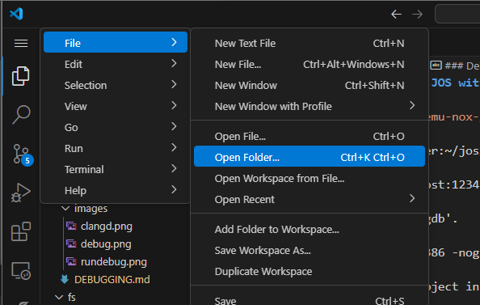
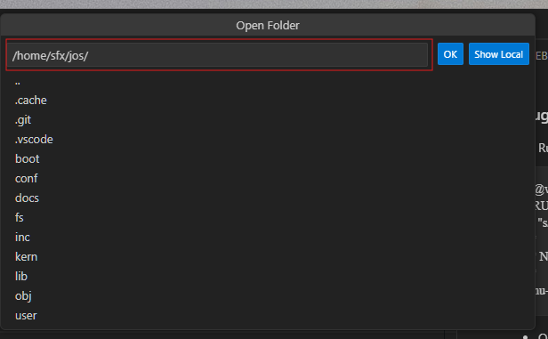
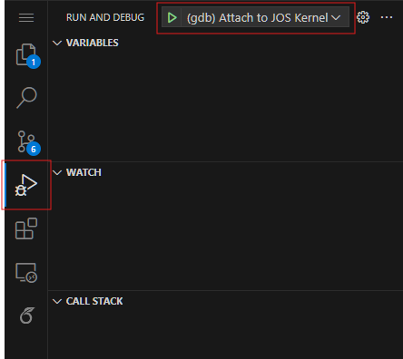
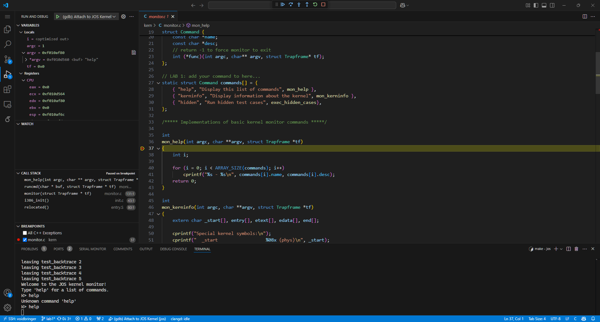
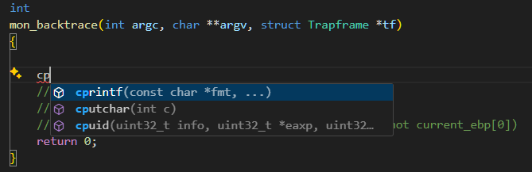
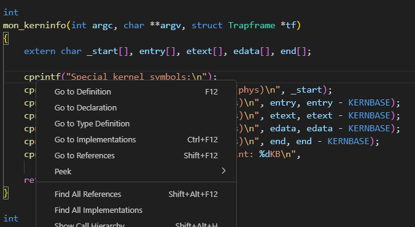
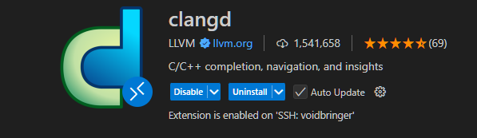

### Debugging JOS with VSCode
- Open the project in VSCode by navigating to the project directory after clicking on `File -> Open Folder`.





- You can toggle the terminal in vscode by pressing **Ctrl + \`** (backtick/tilde). Now run `make qemu-nox-gdb` in the terminal to start QEMU with GDB support. The last few lines of the output should look like this.
 . You can also have a separate terminal window open to run the qemu commands.

```
sfx@voidbringer:~/jos$ make qemu-nox-gdb
<TRUNCATED>
sed "s/localhost:1234/localhost:26000/" < .gdbinit.tmpl > .gdbinit
***
*** Now run 'gdb'.
***
qemu-system-i386 -nographic -drive file=obj/kern/kernel.img,index=0,media=disk,format=raw -serial mon:stdio -gdb tcp::26000 -D qemu.log  -S
```

- Open the `Run and Debug` tab and click on the green play icon to attach to the running QEMU instance.

**Make sure you have "Attach to JOS kernel selected".**

.

- When you first attach to the kernel the debugger will not stop the kernel and the kernel will continue to run. You can pause the kernel by clicking on the pause button on the toolbar or by setting a breakpoint before the debug session starts running.
- You can set breakpoints by clicking on the left side of the line number in the editor. A red dot should appear indicating that a breakpoint has been set as shown in the image below.


You can use the toolbar on top of the vscode window to control the execution of the code. The following table explains the different buttons on the toolbar in the order they appear from left to right.

| Action          | Explanation                                                                                                      |
|-----------------|------------------------------------------------------------------------------------------------------------------|
| Continue / Pause| **F5**: Continue: Resume normal program/script execution (up to the next breakpoint). Pause: Inspect code executing at the current line and debug line-by-line. |
| Step Over       | **F10**: Execute the next method as a single command without inspecting or following its component steps.        |
| Step Into       | **F11**: Enter the next method to follow its execution line-by-line.                                             |
| Step Out        | **Shift+F11**: When inside a method or subroutine, return to the earlier execution context by completing remaining lines of the current method as though it were a single command. |
| Restart         | **Ctrl+Shift+F5**: Terminate the current program execution and start debugging again using the current run configuration. |
| Stop            | **Shift+F5**: Terminate the current program.                                                                     |

- Now you should be able to set breakpoints and debug the code.

- The bottom left window titled `Breakpoints` will let you see all the breakpoints that you have set. You can enable or disable them by clicking on the checkbox next to the breakpoint. 



**NOTE:** Sometimes the debugger will not attach, in that case, you can try checking if any stray qemu processes are active. Kill those processes and try to attach to it again. 

```shell
ps aux | grep qemu # To find the PID of the qemu process
kill -9 <PID>
```

### Quality of Life Improvements

**IMPORTANT DISCLAIMER: These steps are entirely optional quality-of-life improvements and not required for the core project. Please do not dedicate excessive time to this setup if you're focused on meeting project deadlines.**

#### Overview
If you use Neovim/Clangd or VSCode/Clangd for development, This guide will help you set up advanced code intelligence features in your development environment, specifically:
- Code autocompletion
- Go-to definition functionality  
- Real-time code diagnostics and error detection
- Symbol navigation
- Automated refactoring tools

**Code Autocompletion:**


**Go-to Definition Navigation:**

### 1. Install the Clangd Extension
First, you'll need to install the clangd language server extension for your editor:

**For Visual Studio Code:**
1. Open VS Code
2. Navigate to the Extensions marketplace
3. Search for "clangd"
4. Install the official clangd extension


### 2. Install Latest CMake Version
You'll need an up-to-date version of CMake. Follow these detailed steps:

```shell
# Download the CMake installer script
wget https://github.com/Kitware/CMake/releases/download/v3.31.3/cmake-3.31.3-linux-x86_64.sh

# Make the script executable (if needed)
chmod +x cmake-3.31.3-linux-x86_64.sh

# Run the installer
./cmake-3.31.3-linux-x86_64.sh
```

**Adding CMake to Your System PATH:**
You must ensure the CMake executable is accessible from anywhere in your system. Add this to your shell configuration file:

For Bash users (edit ~/.bashrc):
```shell
export PATH=$PATH:/path/to/cmake/bin
```

### 3. Install Bear (BuildEAR)
Bear is a tool that generates compilation databases for clang-based tools. Here's the detailed installation process:

```shell
# Clone the Bear repository
git clone https://www.github.com/rizsotto/Bear

# Navigate into the Bear directory
cd Bear

# Create and enter build directory
mkdir build
cd build

# Configure the build with CMake
cmake -DCMAKE_BUILD_TYPE=Release \
      -DBUILD_SHARED_LIBS=OFF \
      -DENABLE_UNIT_TESTS=OFF \
      -DENABLE_FUNC_TESTS=OFF \
      -DCMAKE_INSTALL_PREFIX=/path/to/install/location \
      ..

# Build Bear using all available CPU cores
make -j$(nproc)

# Install Bear to the specified location
make install
```

**Important:** Replace `/path/to/install/location` with your preferred installation directory.

**Adding Bear to Your System PATH:**
Similar to CMake, add Bear's installation directory to your PATH:
```shell
export PATH=$PATH:/path/to/install/location/bin
```

### Generating the Compilation Database

After installing all prerequisites, you can generate the compilation database for your project:

```shell
# Generate compile_commands.json while building the project
bear -- make qemu-nox
```
The compile_commands.json file should be automatically detected by your development environment if configured correctly and you should have access to all the code intelligence features.